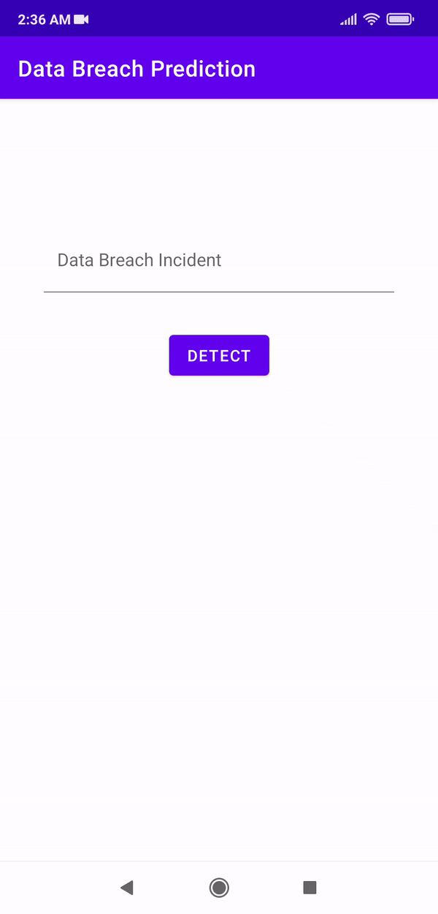
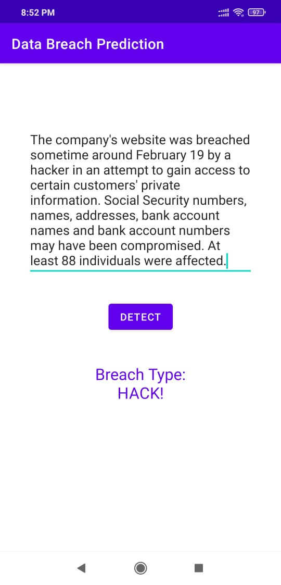

# Data Breach Prediction Android
This Android Application is a part of my M.Sc Thesis. Here, an user gives the Data Brech Incidents as input and the app displays the type of breach it has predicted. The classification process is done in Google Cloud where I uploaded the trained model and required python script for classification.

  
